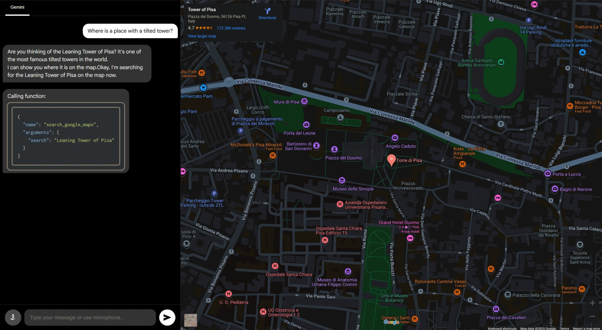

# Google Maps MCP with Speech Input

> [!NOTE]  
> I did not develop this project from scratch. The original project was developed by Google on [AI Studio Apps](https://aistudio.google.com/apps).

A slight upgrade from [Basic MCP Maps](https://aistudio.google.com/apps/bundled/mcp_maps_basic). Adding **speech** as input option.




## Run Locally

**Prerequisites:**: [Node.js](https://nodejs.org/en)

1. Clone the repository
   ```bash
   git clone "https://github.com/l145dev/Google-Maps-MCP-Speech"
   ```
2. Navigate to the repository
   ```bash
   cd ./Google-Maps-MCP-Speech
   ```
3. Install dependencies:
   ```bash
   npm install
   ```
5. Create .env.local: <br>
   **Windows (Make sure you have WSL, check by trying `wsl --version`)**:
   ```bash
   wsl touch .env.local
   ```
   **Linux/Mac**:
   ```bash
   touch .env.local
   ```
7. Open in your desired code editor.
   ```bash
   code .
   ```
8. Set the `GEMINI_API_KEY` in [.env.local](.env.local) to your Gemini API key. Get your API key [here](https://aistudio.google.com/apikey).
   ```env
   GEMINI_API_KEY="YOUR_API_KEY"
   ```
9. Run the app:
   ```bash
   npm run dev
   ```
11. Open web app in your browser at http://localhost:5173.
